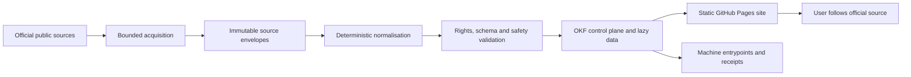
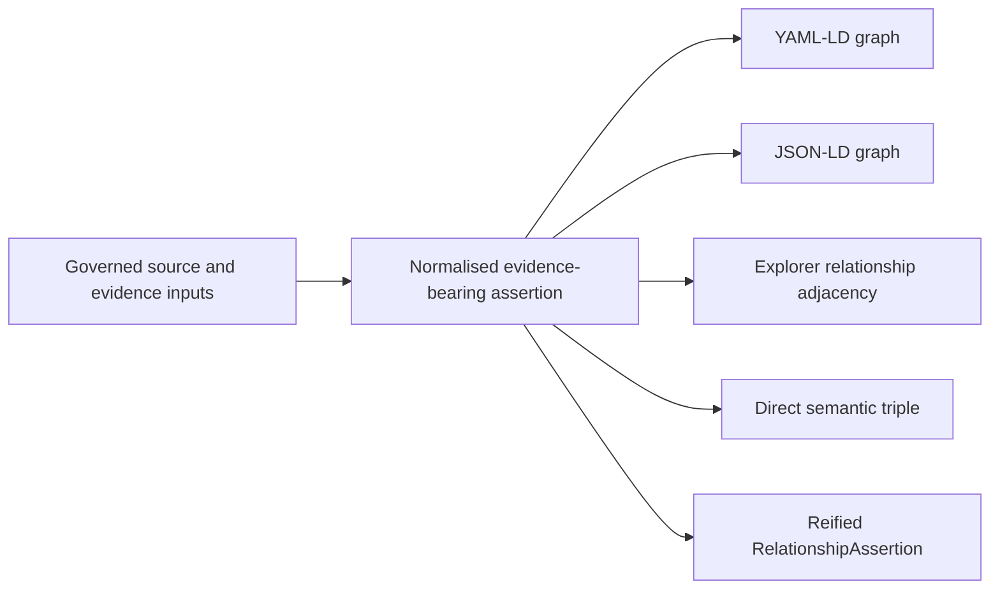
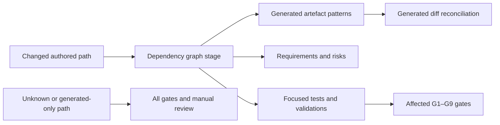

# Architecture

Status: released v0.2.0 architecture plus approval-neutral v0.3.0 semantic
candidate bytes. Corrections identified by the P1 implementation review are
locally regression-tested. The bytes do not assert a current independent-gate,
Land Registry G9 or release state; exact digest-bound external evidence does.

## Architectural decision

The bundle uses the OKF large-corpus shape selected in `DEC-ARCHITECTURE`: a
small Markdown control plane plus lazy, static machine-readable data. This
fits the observed GOV.UK denominator of 1,866 records and the independently
refreshed associated-source lanes without putting source datasets or the
whole catalogue in the first browser payload.

GitHub Pages is the publication target. Acquisition and generation happen
before deployment; the public site is static and never authenticates to HM
Land Registry or searches restricted services.

## Planes and trust boundaries

| Plane | Responsibility | Trust boundary |
|---|---|---|
| Discovery profile | scope, authority, decisions, evidence and acceptance contract | reviewed, digest-bound Stage 1 pack |
| Acquisition | bounded reads of allowlisted public metadata endpoints | the network is untrusted; redirects, size and content type must be checked |
| Source snapshot | immutable response envelopes and terminal outcomes | never public by default; no secrets, signed URLs or personal data |
| Normalisation | stable records, typed relationships and source-native fields | deterministic code only; no silent semantic inference |
| Bundle | OKF control concepts, descriptor, manifests, shards and checksums | public metadata projection; all references and counts must validate |
| Presentation | accessible search, filters and record views | static assets; no authentication, tracking or live provider dependency |
| Assurance | evaluation and validation receipts | receipts bind exact input and output digests, tools and policy versions |

## Data flow

1. **Lock discovery.** Validate the reviewed domain-profile pack and record its
   root digest. Any material scope, authority or rights change starts a new
   review.
2. **Acquire.** Fetch only allowlisted public metadata using bounded
   pagination. Record success, explicit exclusion, not-found, denied and error
   as terminal outcomes.
3. **Freeze.** Store raw bytes or canonical response envelopes with source URL,
   retrieval time, media type, status and SHA-256 digest.
4. **Normalise.** Preserve source-native identity and dates, add stable local
   identifiers, and relate representations without collapsing them.
5. **Validate.** Check schemas, counts, references, safe paths and URLs,
   rights/access states, forbidden content, collisions and checksum closure.
6. **Generate.** Build the OKF control plane, data manifests, catalogue
   projection, provenance, rights ledger, evaluation report and static site.
7. **Rebuild.** Generate twice in clean workspaces from the same snapshot and
   compare every governed byte.
8. **Approve and deploy.** Publish only the candidate whose checksums and
   receipts the owner approved.

## Semantic relationship projection

The normalised relationship assertion list is the single build-time source
for all directed edges. The generator validates its semantic endpoint IRIs
and local routes, then emits synchronised representations:

YAML-LD and JSON-LD are deterministic serialisations of the same in-memory
graph. JSON-LD uses deterministic compact JSON whitespace so the complete graph
remains an ordinary Git and GitHub Pages artefact below GitHub's 100 MiB blob
ceiling. Within one candidate it parses to exactly the same data model as
YAML-LD. Changing the generator correctly rebinds governed provenance
identities to that generator's digest, so a regenerated candidate has a new
graph and release root even though its source-domain assertions and stable
assertion identities are preserved. Every semantic entity carries an explicit
local route; the browser does
not infer a route from an external IRI or fetch arbitrary remote contexts.
The direct triple supports ordinary graph traversal, while the reified node
preserves direction, inverse wording, authority, derivation, observation,
field-level evidence and rights. Tests fail if either form is absent or if
the direct and reified triples differ.

Canonical YAML-LD and equivalent JSON-LD are generated from that same graph;
neither generated file is an independent authoring surface. Authoritative
content, evidence, governance, profile and schema inputs are declared in
`okf.semantic.json`. Everything under `bundle/` is generated output and must
not be repaired by hand.

### Exact consumer and scale boundary

The v0.3.0 candidate admits only Explorer v0.6.1 at commit
`839d4ba4c2d02abc6ef02b3ca1dcbf6a4008e7c8`, the exact 16-file Bundle Wiki
v1 semantic profile and the two-file Predicate Registry v2 extension locked
in `contracts/okf-explorer.consumer-lock.json`. The shared semantic assertion
schema is pinned at 7,308 bytes with SHA-256
`f69480328db4b64d678d9c50b6534d808000f7fb50a30e8cc9e3bf2facbcb8bc`.
The v2 registry schema is pinned separately at 7,551 bytes with SHA-256
`037151379a1ec0cbfe0666d41592585a891a63929f1fcf2845d1eb3de8dd5069`.
Changing the consumer, any profile file, schema bytes or lock digest requires
fresh compatibility evidence.

The governed source-plane projection produces 22,267 direct triples, 22,267
reified assertions and 22,267 Explorer runtime rows across 13 active
predicates. Predicate Registry v2 is an external, digest-bound semantic-model
resource containing all 22 authorised capabilities. The builder derives 13
`active-emitted` rows and nine `authorised-zero-evidence` rows from the same
complete assertion plane, reconciles every per-predicate count, rejects
undeclared emissions and binds every registry field except `root_sha256` into
that root. Zero-evidence rows do not create triples, and this architecture does
not claim that the pinned Explorer v0.6.1 PWA displays them. The IRI-to-route
registry covers all 10,951 route-bearing semantic identities. The rich
relationship-runtime locator covers the 6,694 routes that are incident to at
least one runtime assertion, using 90 compressed relationship chunks and a
256-bucket SHA-256 locator. A digest-bound build receipt must reconfirm these
candidate measurements; they are not fixed architectural constants or release
evidence.

The generated class-to-route registry also covers all 10,951 route-bearing
semantic identities. It is a deterministic delivery index derived from each
canonical graph node's authoritative `rdf:type` facts and the digest-bound
IRI-to-route registry, and its receipt binds both source roots. It cannot add,
remove or override class membership and is not ontology authority or an
inference result. Publication of the sidecar does not claim that the pinned
Explorer v0.6.1 PWA consumes or presents it.

Chunk order is deterministic and locality-aware: an assertion is anchored to
its highest-degree endpoint, with code-point and assertion-identity tie-breaks.
The build still validates every one of the 6,694 relationship-runtime locator
routes rather than relying on that heuristic. It also models Explorer's
independent full default-plane loading path. Both paths are checked against the
exact pinned row, chunk, compressed-byte, decoded-byte and retained-text
ceilings, and their measured maxima are written to
`bundle/data/semantic/validation.json`.

The compressed runtime is intentionally smaller than the authoritative graph.
It retains assertion and endpoint identities, predicate, direction, labels,
authority source, derivation, evidence identity and URL, source field and
source-value hash, observation time, and rights source. Repeated optional
artefact paths, digests and normalisation locators remain available in
canonical YAML-LD/JSON-LD and are not duplicated into every browser row.
Normalised browser rows also use the concise authority label `Derived` and the
rights summary `See source rights.`, and omit the optional release-review
status. The canonical assertion graph retains the complete authority label,
rights statement and review status. Before reserving a publication swap slot,
the builder projects every fresh source relationship in memory and applies the
exact Explorer v0.6.1 UTF-16 retained-text ceiling; generated chunks must later
reconcile to the same measurement.

The selective CPSV-AP projection reviews 11 candidate service records: 7 are
mapped, 4 are explicitly excluded, and 19 evidence references support those
decisions. Before reserving the publication swap slot, the builder also checks
the complete fresh semantic projection. The HMLR organisation's exact spatial
target must be the governed England and Wales `dcterms:Location`; the
administrative-territorial-unit class remains authorised with zero instances
because that combined jurisdiction is not one EU administrative territorial
unit. The official Public Organisation shape's ATU range is therefore
deliberately not claimed as satisfied. CPSV-AP 3.2.0 resources, including its
official SHACL shapes, are vendored and digest-bound. The official shapes have
not been run, so the local bounded checks do not establish CPSV-AP SHACL
conformance. Semantic inference has also not been run; the runtime serves
asserted graph material only.

The source-field evidence, CPSV adversarial-binding and URL-hardening
corrections identified by independent review are implemented and covered by
local regression tests. This architecture describes candidate bytes, not a
release-readiness decision. Version-scoped independent evidence and the G9
decision for the exact digest are authoritative for that state.

## Change-impact dependency graph

`governance/artifact-dependency-graph.json` is the machine-readable
source-to-artefact dependency control. Its nodes classify authored inputs and
generated outputs, and attach the requirements, risks, validation references,
focused tests and G1–G9 release gates that a change can affect. The graph is
validated against
`schemas/artifact-dependency-graph.schema.json` and against the live
requirement, risk and validation IDs before it is used.
This is the implementation control for `REQ-020`, `RISK-017` and
`VAL-CHANGE-IMPACT`.

Stage `inputs` and `validation_inputs` together define the complete protected
candidate-control surface. Both are bound by the candidate Git SHA and the
G1–G9 evidence chain, but neither role is automatically a bundle producer.
Tests, validators, workflow controls, release tooling and prose therefore
select checks and gates without churning bundle bytes.

The separate top-level `build_inputs` role is the causal build boundary. For
this candidate, 44 safe literal-or-final-`/**` patterns expand to exactly 71
files. Those files alone are hashed into `bundle/build-receipt.json`; every
change to one predicts `bundle/**`, `bundle/build-receipt.json` and
`bundle/CHECKSUMS.sha256`, and selects build-semantics, bundle and
reproducibility checks. The classifier reports the complete 153-file
candidate-control expansion separately. This distinction keeps exact build
causality separate from exact release assurance without weakening either.

The graph is not permitted to weaken its own boundary. `scripts/change_impact.py`
contains an independently executable bootstrap for the exact 44 input patterns
and four generated-root patterns. Initial graph validation fails if a causal
input is removed, added or reclassified as generated; a reviewed causal change
must update the bootstrap, graph and regression tests together. This duplicate
control is intentional because a contract read only from the graph could be
removed by the same graph and then omitted from its own receipt.

A release build is a transaction over the stage-0 Git index. Every expanded
causal file must already be indexed, must be a regular non-symbolic-link file,
and must have worktree bytes equal to its indexed Git blob. The builder captures
those bytes once through bounded no-follow descriptors. Generated projections,
copied pages, validators and the build receipt all consume that immutable
snapshot. Immediately before installing `bundle/`, the builder proves that the
index and every captured worktree identity are unchanged. This prevents a
receipt calculated from one byte sequence being paired with an output made from
another. Locally, stage reviewed authored inputs before building; stage the
resulting generated bundle only after the build succeeds.

Publication does not delete the live directory. An owner supplies an exact,
absolute and initially absent `--previous-output` path outside the repository
but on the same file system. The builder creates the candidate in that swap
slot, holds no-follow descriptors for both parents and both directories, and
rechecks their identities after the final input check. macOS uses
`renameatx_np(RENAME_SWAP)` and Linux uses
`renameat2(RENAME_EXCHANGE)` to exchange the two directory names atomically.
The new candidate is therefore visible at `bundle/` without an absent interval,
and the previous bundle remains at the owner-selected path. An initially absent
live target uses the corresponding exclusive/no-replace primitive. Unsupported
platforms, file systems, cross-device paths and target races fail closed; there
is no delete-and-rename fallback and no automatic recovery pruning.

The concrete recovery location is operational state, not candidate content.
It is reported by the build but represented by
`<owner-selected-empty-same-filesystem-path>` in the deterministic receipt.
Every repeat build uses a distinct path, so it cannot overwrite an earlier
recovery bundle. The output-parent advisory lock serialises cooperating
builders; it is not a compare-and-swap guarantee against an uncooperative
namespace mutator, so descriptor identities are rechecked immediately before
and after the atomic operation.

The causal set includes `requirements-lock.txt`, because CI uses that exact
lock to provision the Python environment whose JSON Schema and YAML libraries
affect generated bytes. It excludes `pyproject.toml` and
`requirements-dev.txt`: the governed build command neither installs the
project nor resolves the development requirements file. Those files remain
candidate-bound release controls and a change to either still selects the
appropriate assurance gates.

The runtime contract requires repository-local CPython 3.12.11 in isolated
mode, disabled bytecode writes and user site, no `PYTHONPATH` or other external
startup controls, a fresh external empty private cache namespace, exact locked
package versions and an exact site-packages closure. The target is created
without pip and populated externally with `--no-compile --require-hashes`; no
bootstrap or local distribution is admitted. Every installed member except the
single narrowly defined `RECORD` self-entry requires its declared SHA-256 and
exact size, while the self-entry is independently hashed. `.pth`, customiser,
bytecode, symbolic-link, special and unowned files fail the observation.

The in-process observer starts after Python startup and initial imports; it
verifies the runtime before release work continues but does not attest the
exact source bytes already executed. The executable pre-invocation check
rejects `.pth`, bytecode and customiser hooks and holds a cooperating
single-writer lock for the build. This is a fail-closed operational mitigation,
not cryptographic proof against an uncooperative concurrent mutator. A pre-site
staged launcher would be needed to close that remaining gap and is proposed for
a future contract revision.

Platform-specific installed-tree and `RECORD` digests are enforcement and
separate local-audit detail, not bundle identity: compiled wheel paths and bytes
can legitimately differ between macOS and Linux. The portable build receipt
records only the causal lock digest, exact package/version identity and stable
assurance states. The parser rejects unknown top-level requirement forms.
Compressed relationship
chunks use an explicit `gzip.GzipFile` contract with fixed timestamp, empty
filename and OS byte 255. A golden compressed vector pins the emitted bytes
across macOS and Linux; zlib version strings are diagnostic only and do not
become platform-specific candidate identity.

Both inventories use the same fail-closed pattern grammar and NUL-safe Git
enumeration. Git output, path counts, individual causal files, aggregate causal
bytes, JSON documents and generated-file hashes have executable ceilings and
are read incrementally where retention is unnecessary. Generated roots,
missing matches, symbolic links and mutable
`validation/` or `dist/` evidence are rejected. Dynamic sources selected by
the composite manifest and CPSV evidence must also occur in the causal set.
The authored-page copier copies only declared causal page files and fails on
any unexpected, ignored, untracked, symbolic-link or non-regular worktree
entry; an editor file such as `pages/.DS_Store` cannot enter the bundle.
Vendored profile and CPSV-AP trees enforce their own exact lock inventories,
and the release build requires an explicit snapshot directory.

The builder validates the graph schema and its causal subset without reading
assurance-only requirements, risks or test bytes. The change-impact classifier
performs the complete relational validation separately. The ignored generated
diagnostic `evaluation/latest-report.json` and historical
`evaluation/acceptance-review.json` are both outside the causal receipt; they
remain governed as generated evidence and candidate assurance respectively.

`scripts/change_impact.py` applies the graph to either an explicit path set or
an exact Git commit comparison. It also follows existing governance
traceability and requirement verification references. Its result is a
deterministic planning report:

This classifier fails closed. An unknown authored path, or a generated change
without a declared changed input that predicts it, selects every release gate
and requires manual graph review. Direct edits to `bundle/`, `dist/` or
`validation/` are never accepted as a correction path.

Selected downstream consumers are first-class dependencies. The pinned
Explorer identity and loader assumptions live in
`contracts/okf-explorer.consumer-lock.json`; source, build-engine, governance
and contract changes select `tests.test_explorer_contract`. This prevents a
schema-valid producer artefact from being treated as usable until the selected
Explorer consumer has loaded its descriptor and referenced assets.
The v0.3.0 candidate compatibility window is deliberately narrow: only
Explorer `v0.6.1` at the recorded executable commit, the exact 16-file Bundle
Wiki v1 profile and the exact two-file Predicate Registry v2 extension are
admitted. Admitting any other consumer version or profile identity requires
rerunning the positive, degraded and malformed fixtures and the complete
candidate journeys with that exact executable.
That edge implements `REQ-019`, mitigates `RISK-016` and selects
`VAL-EXPLORER-CONSUMER`.

The graph reduces search and rerun effort; it does not weaken assurance.
Current receipts remain bound to the exact release root, so any changed
governed byte still requires replacement evidence for that exact candidate,
and G9 remains an owner decision. The current generator is substantially
monolithic, so a change to `scripts/build.py` intentionally has a broad
`bundle/**` impact. Finer generator modules and per-plane digest roots can
later narrow this edge without guessing about code semantics.

## Identity and versioning

- Retain the source URL and every stable source-native identifier.
- Assign local identifiers in a governed namespace only after canonicalisation.
- Fail on collisions; never resolve them with traversal order or random values.
- Treat a source edition, dataset, distribution, service, API product and
  repository as distinct record kinds.
- Publish a new snapshot for a new observation. Do not backpatch a released
  snapshot.
- Keep publisher dates, observation time, transformation time and bundle
  release time in separate fields.

The canonical v0.2.0 namespace is
`https://chris-page-gov.github.io/okf-LandRegistry/id/`; `DEC-RELEASE` binds
that identity to the exact approved digest.

## Public site design constraints

Core browsing and source navigation must work without JavaScript. Enhancement
may add client-side search, facets, URL-persisted state and incremental
rendering. The site must:

- load only local static assets and governed metadata;
- make source authority, observation, rights, access and caveats visible;
- avoid third-party analytics, cookies and tracking;
- render bounded result sets with an explicit result count;
- expose raw JSON/CSV entrypoints and checksums;
- preserve useful focus after filtering or loading more results; and
- degrade to navigable HTML when enhancement fails.

## Failure behaviour

Builds fail closed for missing mandatory evidence, checksum mismatch,
identifier collision, traversal path, non-allowlisted scheme, credential-like
material, signed download URL, prohibited source layer, unresolved reference
or rights state. Network failure during acquisition becomes an explicit
terminal outcome; it must not be silently replaced with stale or partial data.

Operational facts such as fees, release availability and Local Land Charges
coverage are volatile. The static site must show the observation boundary and
send the user to the current official source before action.

## Deferred architecture

The candidate still defers live federation, authenticated provider calls,
production property data, model-assisted enrichment, official CPSV-AP SHACL
execution, semantic inference and participant-validated usability claims. It
publishes a bounded semantic graph but does not claim general RDF/OWL
reasoning or SHACL conformance. Federation should be reconsidered only if
source lanes acquire different governance or release ownership.

See [maintenance and reproducibility](maintenance-and-reproducibility.md),
[metadata model](metadata-model.md) and
[release assurance](release-assurance.md).
