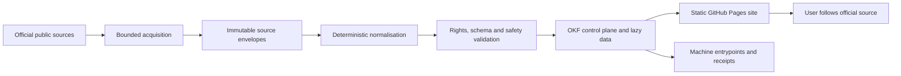
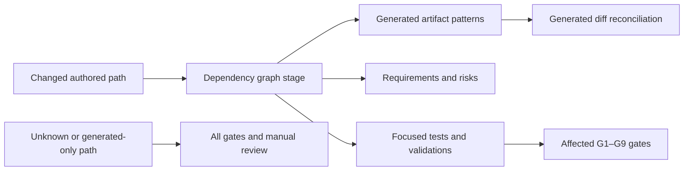

# Architecture

Status: v0.2.0 AI-generated PoC release-candidate architecture.

## Architectural decision

The bundle uses the OKF large-corpus shape selected in `DEC-ARCHITECTURE`: a
small Markdown control plane plus lazy, static machine-readable data. This
fits the observed GOV.UK denominator of 1,866 records and the independently
refreshed associated-source lanes without putting source datasets or the
whole catalogue in the first browser payload.

GitHub Pages is the publication target. Acquisition and generation happen
before deployment; the public site is static and never authenticates to HM
Land Registry or searches restricted services.

## Planes and trust boundaries

| Plane | Responsibility | Trust boundary |
|---|---|---|
| Discovery profile | scope, authority, decisions, evidence and acceptance contract | reviewed, digest-bound Stage 1 pack |
| Acquisition | bounded reads of allowlisted public metadata endpoints | the network is untrusted; redirects, size and content type must be checked |
| Source snapshot | immutable response envelopes and terminal outcomes | never public by default; no secrets, signed URLs or personal data |
| Normalisation | stable records, typed relationships and source-native fields | deterministic code only; no silent semantic inference |
| Bundle | OKF control concepts, descriptor, manifests, shards and checksums | public metadata projection; all references and counts must validate |
| Presentation | accessible search, filters and record views | static assets; no authentication, tracking or live provider dependency |
| Assurance | evaluation and validation receipts | receipts bind exact input and output digests, tools and policy versions |

## Data flow

1. **Lock discovery.** Validate the reviewed domain-profile pack and record its
   root digest. Any material scope, authority or rights change starts a new
   review.
2. **Acquire.** Fetch only allowlisted public metadata using bounded
   pagination. Record success, explicit exclusion, not-found, denied and error
   as terminal outcomes.
3. **Freeze.** Store raw bytes or canonical response envelopes with source URL,
   retrieval time, media type, status and SHA-256 digest.
4. **Normalise.** Preserve source-native identity and dates, add stable local
   identifiers, and relate representations without collapsing them.
5. **Validate.** Check schemas, counts, references, safe paths and URLs,
   rights/access states, forbidden content, collisions and checksum closure.
6. **Generate.** Build the OKF control plane, data manifests, catalogue
   projection, provenance, rights ledger, evaluation report and static site.
7. **Rebuild.** Generate twice in clean workspaces from the same snapshot and
   compare every governed byte.
8. **Approve and deploy.** Publish only the candidate whose checksums and
   receipts the owner approved.

## Change-impact dependency graph

`governance/artifact-dependency-graph.json` is the machine-readable
source-to-artifact dependency control. Its nodes classify authored inputs and
generated outputs, and attach the requirements, risks, validation references,
focused tests and G1–G9 release gates that a change can affect. The graph is
validated against
`schemas/artifact-dependency-graph.schema.json` and against the live
requirement, risk and validation IDs before it is used.
This is the implementation control for `REQ-020`, `RISK-017` and
`VAL-CHANGE-IMPACT`.

Artifact-producing `inputs` are distinct from `validation_inputs`. A validator
or test change selects its assurance surface but does not falsely predict that
the generator changed public bytes. New test paths are unclassified until they
are attached to a reviewed stage, so they fail closed rather than inheriting an
arbitrary nearby test's authority.

`scripts/change_impact.py` applies the graph to either an explicit path set or
an exact Git commit comparison. It also follows existing governance
traceability and requirement verification references. Its result is a
deterministic planning report:

This classifier fails closed. An unknown authored path, or a generated change
without a declared changed input that predicts it, selects every release gate
and requires manual graph review. Direct edits to `bundle/`, `dist/` or
`validation/` are never accepted as a correction path.

Selected downstream consumers are first-class dependencies. The pinned
Explorer identity and loader assumptions live in
`contracts/okf-explorer.consumer-lock.json`; source, build-engine, governance
and contract changes select `tests.test_explorer_contract`. This prevents a
schema-valid producer artifact from being treated as usable until the selected
Explorer consumer has loaded its descriptor and referenced assets.
The v0.2.0 compatibility window is deliberately narrow: only Explorer
`v0.5.7` at the recorded executable commit is certified. Admitting any other
consumer version requires rerunning the positive, degraded and malformed
fixtures and the complete candidate journeys with that exact executable.
That edge implements `REQ-019`, mitigates `RISK-016` and selects
`VAL-EXPLORER-CONSUMER`.

The graph reduces search and rerun effort; it does not weaken assurance.
Current receipts remain bound to the exact release root, so any changed
governed byte still requires replacement evidence for that exact candidate,
and G9 remains an owner decision. The current generator is substantially
monolithic, so a change to `scripts/build.py` intentionally has a broad
`bundle/**` impact. Finer generator modules and per-plane digest roots can
later narrow this edge without guessing about code semantics.

## Identity and versioning

- Retain the source URL and every stable source-native identifier.
- Assign local identifiers in a governed namespace only after canonicalisation.
- Fail on collisions; never resolve them with traversal order or random values.
- Treat a source edition, dataset, distribution, service, API product and
  repository as distinct record kinds.
- Publish a new snapshot for a new observation. Do not backpatch a released
  snapshot.
- Keep publisher dates, observation time, transformation time and bundle
  release time in separate fields.

The canonical v0.2.0 namespace is
`https://chris-page-gov.github.io/okf-LandRegistry/id/`; `DEC-RELEASE` binds
that identity to the exact approved digest.

## Public site design constraints

Core browsing and source navigation must work without JavaScript. Enhancement
may add client-side search, facets, URL-persisted state and incremental
rendering. The site must:

- load only local static assets and governed metadata;
- make source authority, observation, rights, access and caveats visible;
- avoid third-party analytics, cookies and tracking;
- render bounded result sets with an explicit result count;
- expose raw JSON/CSV entrypoints and checksums;
- preserve useful focus after filtering or loading more results; and
- degrade to navigable HTML when enhancement fails.

## Failure behaviour

Builds fail closed for missing mandatory evidence, checksum mismatch,
identifier collision, traversal path, non-allowlisted scheme, credential-like
material, signed download URL, prohibited source layer, unresolved reference
or rights state. Network failure during acquisition becomes an explicit
terminal outcome; it must not be silently replaced with stale or partial data.

Operational facts such as fees, release availability and Local Land Charges
coverage are volatile. The static site must show the observation boundary and
send the user to the current official source before action.

## Deferred architecture

The released PoC deliberately defers live federation, authenticated
provider calls, production data files, model-assisted enrichment, full
RDF/SHACL publication and participant-validated usability claims. Federation
should be reconsidered only if source lanes acquire different governance or
release ownership.

See [maintenance and reproducibility](maintenance-and-reproducibility.md),
[metadata model](metadata-model.md) and
[release assurance](release-assurance.md).
