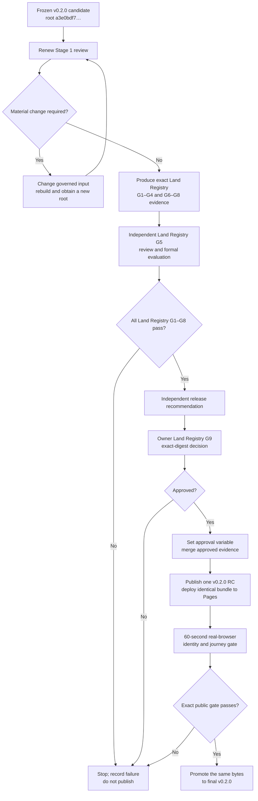

# v0.2.0 release tracker and public website guide

- Status: **Land Registry G1–G8 evidence and independent recommendation pass;
  owner G9 approval, RC deployment and public verification remain incomplete**
- Audience: maintainers and reviewers who are new to the Foundry workflow
- Last updated: **31 July 2026**

This guide explains what the remaining release blocks mean, why the work
stopped at those blocks, and what must happen before the v0.2.0 website can be
published and described as verified.

It is a tracking and operating document. It is **not** a release approval,
review receipt or substitute for evidence under [`validation/`](../validation/).

## The short version

The v0.2.0 software and public bundle have been rebuilt after two independent
reviews correctly rejected earlier candidates. The current candidate passes
its deterministic and real-browser checks. That does not mean the release is
authorised.

The current candidate has these identities:

| Item | Current value |
|---|---|
| Version | `0.2.0` |
| Product status | `ai-generated-proof-of-concept` |
| Candidate commit containing the governed bundle | `40482c865dc4332162f1e93756d94ca93abe3559` |
| Bundle release root | `a3e0bdf7846893ce29255f6f20a509dad18ef2b367ba3dfbe48c28191377a704` |
| Stage 1 profile-pack root | `47f0a5c1a89c78cdeda8e57623db46036753de752766588874fa5835a36a0d95` |
| Records | 2,203 |
| Pinned Explorer | `v0.5.7`, commit `afd940b6de2d09809ae94dfc77c128936ac7928a` |
| Planned canonical Pages route | **Unverified for v0.2.0 — do not share:** `https://chris-page-gov.github.io/okf-LandRegistry/` |

The bundle root is a fingerprint of the public files. A one-byte change to a
governed public file creates a different root and invalidates evidence or
approval recorded for the old root.

The first rejected candidate root, `e07fafe2…`, is historical. Claude Opus 5
completed both requested reviews and returned `fail`, not `not_run`. Its
evidence is preserved under
[`validation/reviews/failed-e07fafe25bbd816f/`](../validation/reviews/failed-e07fafe25bbd816f/).
It must not be relabelled as approval for a later root.

Claude then reviewed remediated root `50506bff…`. It independently passed all
24 question judgements and eight held-out cases, found zero hard failures and
confirmed that every earlier finding was closed. It nevertheless returned
`fail` for both Stage 1 and G5 because the Python formal evaluator rejected
the pinned Explorer's runtime-tree fingerprint. That failure evidence is
preserved under
[`validation/reviews/failed-50506bff-tree-collation/`](../validation/reviews/failed-50506bff-tree-collation/).

The failure was correct; the suggested diagnosis was not. The two programs
hashed the same 148 files and 31,525,576 bytes in different filename orders:
Node used English `localeCompare`, while Python used bytewise ordering. The
first correction used an installed English operating-system locale and
produced intermediate root `0fdab21a…`. GitHub Actions then correctly failed
closed because its Ubuntu image did not provide that locale.

The final evaluator embeds the pinned consumer's printable-ASCII ordering,
rejects non-ASCII paths and no longer depends on host locale packages.
Because its own hash is recorded in the build receipt, this portability
correction produced current root `a3e0bdf7…`. Both exact browser suites were
rerun and now agree on consumer tree `09ad960c…`.

Claude has now completed the narrow addendum. It independently reproduced the
collation diagnosis, corrected its earlier causal speculation, and returned
`pass` for both Stage 1 and Land Registry G5 on the exact current identities.
The adopted decisions are preserved under
[`validation/reviews/passed-a3e0bdf7-portable-collation/`](../validation/reviews/passed-a3e0bdf7-portable-collation/).
All caveats and non-blocking warnings remain in force.

The remaining shorthand is:

1. review the exact generated G1–G8 receipt hashes and the independent
   recommendation;
2. obtain the project owner's Land Registry G9 approval for those exact
   bytes and stated residual risks;
3. deploy one release candidate and verify its exact public identity and
   journeys; and
4. promote the same bytes without rebuilding them.

Claude Opus 5 has now independently passed Land Registry G6 and recommended
approval across G1–G8, with no blocker or waiver. The sole pre-deployment
decision blocker is the owner's exact-digest G9 decision. The repository's
pre-G9 assembler now creates reviewable G1–G8 receipts without manufacturing
G9; it cannot authorise deployment or publication.

## Two G0–G9 catalogues are in scope

A gate number is only shorthand for an item in a named list, or **gate
catalogue**. It has no universal meaning.

This project uses two catalogues:

1. the generic Foundry workflow, which describes the complete journey from
   domain agreement to public RC verification and byte-identical promotion;
2. the Land Registry release-evidence catalogue v1, which organizes this
   repository's pre-deployment receipts and owner decision.

That is why a bare phrase such as “G5 passed” is unsafe. In the generic
Foundry catalogue, G5 concerns optional model enrichment and evaluation is G6.
In the Land Registry catalogue, G5 is evaluation. Similarly, Foundry G9 means
final byte-identical promotion, while Land Registry G9 means the owner's
pre-deployment approval.

Use the descriptive forms:

- **Land Registry G5 — evaluation**;
- **Land Registry G9 — independent review and owner approval**;
- **Foundry G8 — RC and public validation**; and
- **Foundry G9 — promotion**.

The authoritative Land Registry definitions and full crosswalk are in
[`release-assurance.md`](release-assurance.md). The remaining blocks in this
tracker use the Land Registry catalogue unless they explicitly say
“Foundry”.

## Current tracker

Only mark a row complete when the named evidence exists and binds the current
identities above. A green test or a sentence saying “approved” is not enough.

| Work item | Status | Evidence or reason |
|---|---|---|
| Bounded v0.2.0 source inputs | Complete for the candidate | Composite input manifest and immutable source envelopes |
| Deterministic v0.2.0 bundle | Complete for the candidate | `bundle/CHECKSUMS.sha256`; root `a3e0bdf7…` |
| Two clean, byte-identical builds | Complete for the candidate | Local candidate validation; must be cited in the new Land Registry G7 receipt |
| Unit/integration suite | Complete for the candidate | Claude reviewed the frozen 137-test evidence; the current suite is 140 after one candidate-archive and two pre-G9 assembly regression tests |
| Pinned Explorer search compatibility | Complete for the candidate | 26/26 journeys passed in `explorer-search-runtime-portable-collation-a3e0bdf7.json` |
| Pinned Explorer product compatibility | Complete for the candidate | 6/6 journeys passed in `explorer-product-runtime-portable-collation-a3e0bdf7.json` |
| Degraded and malformed compatibility | Complete against the pinned consumer | Retained exact-consumer fixture receipts under `validation/candidate-v0.2.0/` |
| Change-impact classification | Complete, manual review required | `change-impact-portable-collation-40482c8.json` selects affected work and deliberately prevents new evidence from approving itself |
| Renewed Stage 1 review | Complete | Claude addendum passed exact commit `40482c8…`, root `a3e0bdf7…` and profile root `47f0a5c1…` |
| Independent v0.2.0 Land Registry G5 acceptance | Complete | Claude review and formal report passed 24 questions, eight carried-forward held-outs and zero hard failures |
| Exact v0.2.0 Land Registry G1–G5 source evidence | Complete | `validation/candidate-v0.2.0/evidence/automated-validation.json` plus adopted independent decisions |
| Exact v0.2.0 Land Registry G6 source evidence | Complete | Claude independently passed all four G6 checks for the exact candidate; limitations remain AI/automated, not human assurance |
| Exact v0.2.0 Land Registry G7–G8 source evidence | Complete | Two clean builds and two candidate archives are byte-identical; SBOM and provenance bind the exact root |
| Exact v0.2.0 Land Registry G1–G8 receipts | Complete for owner review | `validation/v0.2.0-pre-g9/pre-g9-evidence.json`; this is deliberately not G9 |
| Independent release recommendation | Complete | Claude returned `recommend_approval` for exact root `a3e0bdf7…`, with no blocker or waiver |
| Land Registry G9 owner approval | **Ready for owner decision / not given** | Owner must review the exact receipts and name the v0.2.0 root, archive, claims, all 17 risks and deployment condition |
| v0.2.0 release candidate | **Not published** | No RC tag or v0.2.0 archive release |
| v0.2.0 Pages deployment | **Not deployed** | Pull-request deployment is deliberately skipped |
| Exact public browser verification | **Impossible until deployment** | No v0.2.0 public URL may be presented as verified |
| Final v0.2.0 promotion | **Not started** | Requires a successful RC deployment receipt and identical bytes |

## Beginner vocabulary

### Build

A build runs the generator against frozen inputs and creates the files under
`bundle/`. A successful build means the computer produced internally
consistent files. It does not decide whether those files should be published.

### Candidate

A candidate is a proposed set of bytes. It can be tested, reviewed and
rejected. Calling something a candidate avoids implying that it is already a
release.

### Release root

The release root is a SHA-256 fingerprint derived from the checksums of the
governed bundle files. It answers: “Which exact bytes are we discussing?”

The short form `a3e0bdf7…` is convenient in prose, but approvals and receipts must
use the complete 64-character value.

### Gate

A gate is a release question that must receive a documented pass. For example,
Land Registry G4 asks whether the data and OKF structures are valid; Land
Registry G5 asks whether the retrieval behaviour and safety expectations were
independently evaluated.

### Receipt

A receipt is machine-readable evidence of what ran, when it ran, what it
checked, who reviewed it where applicable, and which candidate root it
applies to. A receipt for another root is historical evidence, not a pass for
the current candidate.

### Release candidate, or RC

An RC is the one proposed final package deployed for last-mile public checks.
If any governed byte must change after those checks, it was not the final
candidate: a new root, new evidence and a new RC are required.

### Deployment

Deployment copies files to GitHub Pages. Deployment is a technical action.
It is not owner approval and is not proof that the public URL serves the
intended bytes.

### Promotion

Promotion changes the RC from “proposed final release” to “final release”
without rebuilding or altering the bundle. The archive SHA-256 and bundle root
must remain identical.

## Why the work was not completed automatically

Stopping here is a safety property, not an unexplained build failure.

The remaining decisions require either an independent reviewer or the project
owner. The agent that authored the remediation cannot manufacture reviewer
independence, accept residual risk on the owner's behalf, or claim that an
undeployed URL has passed browser checks.

There are also concurrent changes in the original checkout. The candidate was
therefore built in an isolated worktree so that unrelated work was not reset,
overwritten or accidentally included.

The repository deliberately fails closed:

- pull requests verify generation and tests but skip deployment;
- the default-branch workflow validates exact-candidate release evidence;
- Pages steps run only when `OKF_RELEASE_ROOT_SHA256` is non-empty;
- the approval variable must equal the root in `bundle/CHECKSUMS.sha256`; and
- no public URL is considered verified until the deployed URL passes a real
  browser identity and journey check.

## Block 1 — renewed Stage 1 review

### Meaning

Stage 1 defines the problem before the system tries to solve it. It records:

- what is in and out of scope;
- which publishers and sources are authoritative for each kind of claim;
- which public fields may be collected;
- rights, privacy and access boundaries;
- audiences and important user tasks;
- known gaps and unacceptable failure modes;
- the architecture and consumer compatibility window; and
- the evidence and gates required for release.

The Stage 1 pack lives in [`domain-profile/`](../domain-profile/). Its current
pack root is `47f0a5c…`.

### How it was closed

Claude Opus 5 completed a renewed review of the previous `e07…` candidate and
returned `fail`. That was a completed review, not missing work. It found four
blocking issues: an unapproved publication claim, unsafe access and rights
classification for 15 Business Gateway endpoints, a stale v0.1.0 rights
decision projected into v0.2.0, and non-executable evaluation near misses.

Those defects were corrected in candidate `50506bff…`. The profile JSON and
YAML still validate and hash correctly. That remediation changed material
parts of the contract after Claude's first decision, including:

- the `okf-hmlr-record.v2` identity and state model;
- the source-type-to-kind crosswalk;
- Content API language and translation observations;
- the semantic JSON-LD projection;
- the pinned executable Explorer and compatibility window; and
- the artifact dependency graph and release assurance process.

Claude completed the resulting second review. It confirmed that every earlier
blocking finding and warning was closed, but still returned `fail` because
the formal evaluator could not accept the pinned Explorer runtime receipt.
That mismatch was caused by filename collation, as explained in the short
version above.

The correction did not change the domain profile, frozen source observations,
catalogue semantics, question suite, search contract or journeys. It did
change a governed evaluator input, the derived build receipt and therefore
the bundle root. The change-impact result consequently said
`stage1_review_required: true`.

Claude then reviewed the portable correction, independently reproduced both
the old and new consumer-tree identities, and returned `status: pass` and
`outcome: pass` for commit `40482c8…`, bundle root `a3e0bdf7…` and profile root
`47f0a5c1…`. The report has no blocking findings or required changes. It
explicitly remains AI-agent assurance rather than a human HMLR, legal, licence,
privacy, security or accessibility audit.

### Rationale

Without this review, the team could prove that the generator implemented the
wrong scope or unsafe assumptions perfectly. Stage 1 asks whether the build is
the right build, not merely whether it ran correctly.

### Implications

- Technical tests may continue, but publication claims remain blocked.
- The profile root must not be silently changed after review.
- If the reviewer requires a material profile change, rebuild the candidate.
  The `a3e0bdf7…` root and all downstream exact-candidate receipts may then become
  obsolete.
- An AI-agent review is permissible for this labelled proof of concept only if
  its identity, scope and limitations are disclosed. It is not independent
  human domain, legal, licence or accessibility assurance.

### Evidence that closed it

The reviewer:

1. inspect the complete final Stage 1 pack and the remediation diff;
2. verify the source families, authority ordering, rights boundaries,
   exclusions, personas, hard failures, consumer lock and dependency graph;
3. resolve or explicitly accept every blocking decision and residual gap;
4. confirm that the JSON and YAML represent the same contract;
5. record reviewer identity, reviewer kind, independence, scope, completion
   time, outcome, limitations and any required changes;
6. rehash the profile pack; and
7. produce the new exact-candidate Land Registry G1 evidence only after any
   required changes have been incorporated.

The exact decision and its adoption record are in
[`validation/reviews/passed-a3e0bdf7-portable-collation/`](../validation/reviews/passed-a3e0bdf7-portable-collation/).

## Block 2 — independent Land Registry G5 acceptance

### Meaning

Land Registry G5 asks whether users can retrieve the intended authoritative
records while avoiding dangerous near misses. It covers more than whether
search returns something. It corresponds mainly to **Foundry G6 —
evaluation**, not Foundry G5.

For each of the 24 questions, the review must check:

- expected authoritative source targets;
- the propositions the result is expected to support;
- required caveats;
- forbidden or misleading targets that must not rank too highly;
- applicable hard-failure categories; and
- safe behaviour for unanswerable or adversarial cases.

The quantitative thresholds are:

- zero hard failures;
- mean reciprocal rank at least `0.80`;
- Recall@10 at least `0.90`;
- every expected target present in the top ten for its question;
- source-resolution and caveat coverage of `1.00`; and
- no new critical category in the reviewer-owned held-out pass.

### How it was closed

The deterministic calibration currently performs strongly:

- source success: `1.00`;
- expected-target recall: `1.00`;
- all expected target sets: `24/24`;
- mean reciprocal rank: approximately `0.9167`; and
- forbidden-target hits: `0`.

The deterministic calibration alone cannot independently judge whether its
authored expectations are safe and complete. The formal result now says
`hard_failures_evaluated: true` because it incorporates the independent
question-by-question and held-out review.

Claude completed the independent review of the previous `e07…` candidate and
returned `fail`. It found two Business Gateway hard failures in held-out cases
and rejected the near-miss control because every forbidden target was the same
URL and absent from the corpus. It also found that runtime journeys declared
source and caveat expectations without executing them.

The remediated suite now uses 24 present, rank-bounded negative targets.
Claude's second review independently passed all 24 question reviews, executed
eight fresh held-out cases successfully and observed zero hard failures. Its
sole G5 blocker was the runtime-tree mismatch.

The corrected candidate's 26 locked-Explorer search journeys select the
expected source and assert all required caveat IDs; all 26 pass. Its six
product journeys also pass. Both receipts bind tree `09ad960c…`, and the
corrected formal evaluator recomputes the same tree locally. This is strong
executable evidence.

Claude's portable-collation addendum binds the exact root and suite, carries
forward its own eight held-out cases only after proving the relevant candidate
inputs byte-identical, and returns `status: pass`. The formal evaluator rerun
returns a Land Registry G5 pass with all source, target, near-miss and caveat
thresholds met and zero hard failures.

### Rationale

The person or agent implementing search may unconsciously choose easy expected
answers or overlook a dangerous near miss. Separating expectation review from
retrieval implementation reduces that risk.

### Implications

- Passing calibration does not close Land Registry G5.
- The independent reviewer must not simply copy the v0.1.0 decision.
- Reviewer-owned held-out cases must remain separate from calibration cases.
- If Land Registry G5 exposes a search or content defect, fix the governed
  input or generator and rebuild. Do not weaken the expected result after
  seeing the failure without independent justification.
- A changed bundle requires a new root and invalidates an acceptance decision
  written for the previous root.

### Evidence that closed it

The independent evaluation reviewer:

1. receive the frozen v0.2.0 bundle, question-suite digest, source evidence,
   required caveat registry and consumer receipts;
2. verify every expected proposition, source, near-miss rule, caveat ID and
   hard-failure mapping for all 24 questions;
3. run at least six bounded, reviewer-owned adversarial cases without exposing
   them to the retrieval implementer in advance; the same reviewer may carry
   forward its own eight completed cases only after independently proving
   that the catalogue, suite, search contract and journeys are unchanged;
4. record any hard failures or new critical category;
5. create a new v0.2.0 acceptance-review document binding the complete
   `a3e0bdf7…` root and exact question-suite SHA-256;
6. disclose reviewer identity, kind, independence, review scope and
   limitations; and
7. run the formal evaluator with that review:

```bash
.venv/bin/python scripts/evaluate.py \
  --k 10 \
  --min-expected-source-success-at-k 1.0 \
  --min-expected-target-recall-at-k 0.90 \
  --min-all-expected-target-success-at-k 1.0 \
  --min-mrr 0.80 \
  --acceptance-review <reviewed-v0.2.0-acceptance-file> \
  --runtime-journeys evaluation/explorer-search-calibration-v0.2.0.json \
  --runtime-receipt \
    validation/candidate-v0.2.0/explorer-search-runtime-portable-collation-a3e0bdf7.json \
  --output validation/evidence/evaluation-acceptance-v0.2.0.json
```

The command fails if the review names a different suite or release root. Its
adopted output is
[`formal-evaluation-acceptance.json`](../validation/reviews/passed-a3e0bdf7-portable-collation/formal-evaluation-acceptance.json).

## Required exact-candidate Land Registry G1–G8 evidence

This is the important step hidden by the three-line shorthand.

The checked-in canonical gate receipts and release record currently describe
v0.1.0. The v0.2.0 compatibility receipts and source evidence under
`validation/candidate-v0.2.0/` are the current inputs, but they are not yet a
complete new set of Land Registry G1–G8 receipts.

The change-impact report lists every gate as `not_run`. That does not mean the
test suite failed or was not executed. The classifier is a planning tool: by
design, it can select work but cannot claim a pass, reuse evidence or approve
a release.

Evidence producers have now created exact-candidate source artifacts for:

- Land Registry G1: final profile validation and renewed review;
- Land Registry G2: frozen snapshot integrity and terminal-outcome
  reconciliation;
- Land Registry G3: rights, privacy, prohibited-content and safety review;
- Land Registry G4: OKF, data, JSON-LD, identity, checksum and
  pinned-consumer integrity;
- Land Registry G5: the independent acceptance described above;
- Land Registry G6: authored-site and Explorer journeys, accessibility,
  security and performance — **independent AI-agent review passed**;
- Land Registry G7: two clean byte-identical builds and reconciled change
  impact; and
- Land Registry G8: archive, manifest, dependency/workflow provenance and
  release metadata.

The source-evidence status is recorded in
[`pre-g9-gate-status.json`](../validation/candidate-v0.2.0/evidence/pre-g9-gate-status.json).
Each final Land Registry gate receipt must name the exact candidate commit and
`a3e0bdf7…` release root.
Old receipts remain immutable in the v0.1.0 tag and must not be relabelled.

## Block 3 — Land Registry G9 owner approval

### Meaning

Land Registry G9 is the project owner's explicit decision to publish one exact
candidate. It is not a technical test and it is not **Foundry G9 —
promotion**, which happens only after the public RC passes its real-browser
checks.

The owner approves or rejects:

- version `0.2.0`;
- the complete bundle root;
- the candidate commit and Land Registry G1–G8 receipt hashes;
- the planned canonical Pages identity;
- the public claims and prohibited claims;
- every residual risk;
- the source cutoff and refresh policy;
- the licence and attribution statement; and
- the absence of completed human audits where applicable.

### Why it is still open

The current `DEC-RELEASE` authorises preparation of a candidate only.
No owner record approves root `a3e0bdf7…`. Stage 1, Land Registry G5 and G6
are closed; the independent reviewer recommends approval across G1–G8 and the
exact G1–G8 receipt hashes are available. The remaining decision is whether
the owner accepts the disclosed limitations and all 17 residual risks for one
conditional RC deployment.

An implementation agent cannot accept legal, reputational, accessibility,
coverage or operational residual risk on the project owner's behalf. A
general instruction to build or prepare a release is not an exact-digest Land
Registry G9 decision.

### Rationale

Automated checks can establish facts such as checksum equality. They cannot
decide whether the remaining limitations are acceptable to the publisher.
Land Registry G9 makes responsibility visible and prevents a deployment token
or green CI run from becoming accidental authorisation.

### Implications

- Do not set `OKF_RELEASE_ROOT_SHA256` before Land Registry G9.
- Approval applies only to the complete `a3e0bdf7…` value. Any governed-byte change
  reopens Land Registry G9.
- Post-deployment verification is a condition of the approval. A public
  mismatch or critical journey failure reopens the decision.
- The final site must remain labelled an independent AI-generated proof of
  concept, not an HM Land Registry service.

### Evidence required to close it

After reviewing the complete Land Registry G1–G8 evidence and independent
release recommendation, the project owner must record:

1. their identity, role and approval time;
2. `approved: true` or a rejection;
3. version `0.2.0`, the full release root and candidate commit;
4. the planned canonical URL;
5. reviewed public claims and prohibited claims;
6. all accepted residual-risk IDs and dispositions;
7. that no independent human domain, legal, licence or accessibility audit or
   representative-user study has been completed, unless new evidence proves
   otherwise; and
8. the condition that the exact deployed URL must pass the post-deployment
   browser gate before final promotion or public sharing.

The release evidence assembler verifies and hashes supplied decisions. It
does not create or infer them.

## End-to-end publication runbook



### Step 0 — create a clean release environment

Do this only after concurrent work is handed off. Do not reuse a dirty
checkout or reset another contributor's files.

```bash
python3 -m venv .venv
.venv/bin/python -m pip install --require-hashes -r requirements-lock.txt
git status --short
```

`git status --short` must be understood before release work continues. A
documentation or review-packet commit may exist after candidate commit
`40482c8…`, but governed candidate paths must not drift.

Confirm the current roots:

```bash
rg '^# release-root-sha256:' bundle/CHECKSUMS.sha256
rg '^# pack-root-sha256:' domain-profile/CHECKSUMS.sha256
git diff --exit-code 40482c865dc4332162f1e93756d94ca93abe3559 \
  -- bundle domain-profile source/snapshots
```

If the bundle, profile or frozen snapshots differ, stop. Reclassify the
change, decide whether Stage 1 must be repeated, rebuild and replace every
downstream example of `a3e0bdf7…`.

### Step 1 — confirm the renewed Stage 1 review remains bound

Complete the review described in Block 1. Re-run the locked validator:

```bash
.venv/bin/python scripts/check_domain_profile.py \
  domain-profile/domain-profile.json \
  --equivalent domain-profile/domain-profile.yaml
```

Do not continue with a “pass with undocumented edits.” Any required material
edit creates a new profile root and normally a new bundle root.

### Step 2 — rerun and record the exact-candidate checks

At minimum:

```bash
.venv/bin/python scripts/build.py --replace
.venv/bin/python -m unittest discover -s tests -v
.venv/bin/python scripts/check_okf.py
.venv/bin/python scripts/evaluate.py \
  --k 10 \
  --min-expected-source-success-at-k 1.0 \
  --min-expected-target-recall-at-k 0.90 \
  --min-all-expected-target-success-at-k 1.0 \
  --min-mrr 0.80
git diff --exit-code -- bundle
```

The last command proves that rebuilding did not change the frozen public
bytes. The calibration command still does not close Land Registry G5.

Re-run the exact pinned Explorer using the command template in
[`contracts/okf-explorer.consumer-lock.json`](../contracts/okf-explorer.consumer-lock.json).
Run both v0.2.0 journey manifests:

```text
evaluation/explorer-v0.2.0-journeys.json
evaluation/explorer-search-calibration-v0.2.0.json
```

The resulting receipt must record Explorer commit `afd940b6…`, executable
tree `fc11e903…`, a clean consumer source state, release root `a3e0bdf7…`,
consumer tree `09ad960c…`, requests, console output, restored state and
terminal outcome.

Use a new receipt path. Do not overwrite an earlier result merely because the
new run failed.

### Step 3 — confirm Land Registry G5

Follow Block 2. A formal Land Registry G5 result must be produced with
`--acceptance-review`. A calibration-only report cannot be cited as a Land
Registry G5 pass.

For the current candidate, the completed bounded addendum and its adopted
outputs are under
[`review/claude-addendum-v0.2.0-a3e0bdf7/`](../review/claude-addendum-v0.2.0-a3e0bdf7/)
and
[`validation/reviews/passed-a3e0bdf7-portable-collation/`](../validation/reviews/passed-a3e0bdf7-portable-collation/).

If Land Registry G5 fails, report the failure immediately. Do not silently
rewrite the question suite, discard held-out cases or begin a release rebuild
outside the declared change-impact scope.

### Step 4 — complete G6 and the independent release recommendation

Use the bounded packet under
[`review/claude-release-review-v0.2.0-a3e0bdf7/`](../review/claude-release-review-v0.2.0-a3e0bdf7/).
It asks an independent reviewer first to decide the four Land Registry G6
checks, then—only if they pass—to review G1–G8 and return either
`recommend_approval` or `withhold_approval`.

The local browser evidence records zero axe violations on the main,
accessibility and static-catalogue pages, a working first-tab skip link, no
horizontal overflow at 320 CSS pixels, no console/page/resource failures and
no stored cookies or browser storage. The locked Explorer separately passes
26 search journeys and six product journeys. This is AI-agent-assisted
evidence, not a human audit or WCAG conformance claim.

If G6 fails, preserve the decision, report it immediately and use the
dependency graph to select only the affected work. Do not ask the reviewer for
a release recommendation after a failed G6 decision.

### Step 5 — create the deterministic archive and supply-chain evidence

After the candidate and Land Registry G1–G7 evidence are stable:

```bash
.venv/bin/python scripts/package_release.py \
  --output dist/okf-landregistry-0.2.0.zip \
  --receipt \
    validation/candidate-v0.2.0/evidence/release-candidate-archive.json

.venv/bin/python scripts/create_release_metadata.py \
  --candidate-commit-sha 40482c865dc4332162f1e93756d94ca93abe3559 \
  --archive-receipt \
    validation/candidate-v0.2.0/evidence/release-candidate-archive.json \
  --output-directory \
    validation/candidate-v0.2.0/evidence/release-metadata
```

Run packaging twice to separate temporary output paths and compare archive
SHA-256 values. The archive must be byte-identical. Do not edit the ZIP. The
receipt is deliberately `okf-hmlr-candidate-archive.v1` with
`publication_state: unreleased-candidate`: its deterministic member timestamp
comes from `generated_at`, while `release_at` stays null until external G9
evidence exists. This avoids claiming publication merely to make G8 possible.

### Step 6 — review and decide Land Registry G9

The independent release reviewer has read the complete Land Registry G1–G8
evidence and returned `recommend_approval` with explicit limitations. Before
the owner decides, assemble the G1–G8 receipts without a release section:

```bash
.venv/bin/python scripts/assemble_release_evidence.py \
  --pre-g9 \
  --input validation/release-input-v0.2.0-pre-g9.json \
  --candidate-commit-sha 40482c865dc4332162f1e93756d94ca93abe3559 \
  --output-directory validation/v0.2.0-pre-g9 \
  --replace
```

This command creates only G1–G8 receipts and a
`ready_for_owner_review` index. It cannot create G9, authorise deployment or
claim a public URL. After reviewing those exact hashes, the project owner
makes the Land Registry G9 decision described in Block 3.

If the owner approves, populate a new final v0.2.0 assembly input by preserving
the reviewed `gates` object byte-for-byte and adding the owner's explicit G9
decision. Do not copy the v0.1.0 timestamps, reviewers or decisions:

```text
validation/release-input-v0.2.0.json
```

Assemble and verify the evidence:

```bash
.venv/bin/python scripts/assemble_release_evidence.py \
  --input validation/release-input-v0.2.0.json \
  --candidate-commit-sha 40482c865dc4332162f1e93756d94ca93abe3559 \
  --output-directory validation \
  --replace

.venv/bin/python scripts/check_release_evidence.py \
  --candidate-commit-sha 40482c865dc4332162f1e93756d94ca93abe3559
```

Review every generated diff. The assembler validates supplied evidence; it
does not perform the checks or make the approval decision.

### Step 7 — set the deployment approval variable

Only an authorised repository owner should do this, and only after the Land
Registry G9 record is committed and independently checked:

```bash
gh variable set OKF_RELEASE_ROOT_SHA256 \
  --body a3e0bdf7846893ce29255f6f20a509dad18ef2b367ba3dfbe48c28191377a704 \
  --repo chris-page-gov/okf-LandRegistry
```

Then prove the local approval check:

```bash
OKF_RELEASE_ROOT_SHA256=a3e0bdf7846893ce29255f6f20a509dad18ef2b367ba3dfbe48c28191377a704 \
  .venv/bin/python scripts/check_release_approval.py
```

The variable is a release lock, not a secret. Setting it early would be an
authorisation error even though the workflow should still fail on incomplete
release evidence.

### Step 8 — merge the approved evidence and create one RC

The final pull request should contain:

- unchanged `a3e0bdf7…` bundle bytes;
- new v0.2.0 Land Registry G1–G8 receipts;
- the independent release recommendation;
- the Land Registry G9 owner record;
- the deterministic 0.2.0 archive and metadata; and
- no v0.1.1 release claim.

After required checks pass, merge it to the default branch. The Pages workflow
will:

1. rebuild from frozen inputs;
2. run the test suite and calibration;
3. confirm committed and generated bundle bytes match;
4. validate the exact-candidate release evidence;
5. compare the built root with `OKF_RELEASE_ROOT_SHA256`;
6. upload the verified `bundle/` directory; and
7. deploy it to GitHub Pages.

Create one annotated RC tag on the exact merged commit and publish it as a
GitHub prerelease. Use reviewed release notes and the already-created archive:

```bash
git tag -a v0.2.0-rc.1 <exact-merged-commit> \
  -m 'HM Land Registry public-estate OKF v0.2.0 release candidate 1'
git push origin v0.2.0-rc.1
gh release create v0.2.0-rc.1 \
  dist/okf-landregistry-0.2.0.zip \
  --verify-tag \
  --prerelease \
  --latest=false \
  --notes-file <reviewed-release-notes-file> \
  --repo chris-page-gov/okf-LandRegistry
```

Do not let `gh release create` invent a tag from an unspecified default-branch
state. The explicit annotated tag and `--verify-tag` keep the release bound to
the reviewed commit.

### Step 9 — verify the exact deployed public website

The planned route remains **unverified for v0.2.0** until this step passes.
Give the URL check a 60-second, tool-first budget and use a real browser.

The identity check must confirm:

- HTTP success without an unexpected redirect;
- visible version `0.2.0` and AI-generated proof-of-concept status;
- the full root in deployed `CHECKSUMS.sha256` equals `a3e0bdf7…`;
- deployed `okf-explorer.json` has the expected schema, kind, snapshot and
  entrypoints;
- deployed manifests and requested shards match their recorded digests; and
- the public archive SHA-256 matches the RC asset receipt.

The journey check must cover:

- loading the direct Pages experience;
- loading the deployed descriptor in the exact pinned Explorer;
- a known positive and negative search;
- repeated filters, including governed `kind`;
- a selected-record deep link and restored state after reload;
- scalar geography and language/Welsh metadata;
- selected-record resources and evidenced relationships;
- visible safety, source, rights and currency caveats;
- zero browser console/page errors; and
- no failed or unexpected resource requests.

Persist the receipt outside the governed bundle and bind it to the public URL,
deployment commit, release root, Explorer identity, requests, console output
and terminal outcome.

If verification fails:

1. report the failure immediately;
2. label the route **unverified**;
3. do not promote the release;
4. do not silently turn the URL check into a rebuild;
5. use the dependency graph to classify the smallest correction; and
6. if governed bytes change, create a new root, repeat affected gates, obtain
   a new Land Registry G9 decision and publish a new RC.

### Step 10 — promote identical bytes

Promotion is allowed only after the RC public receipt passes.

Before creating `v0.2.0`, compare:

- bundle root;
- archive SHA-256 and size;
- archive file inventory;
- descriptor and manifest digests; and
- deployed public identity.

All must match the RC. Do **not** rerun the build to create a “fresh” final
archive.

Create the final annotated tag and release from the reviewed promotion commit,
attaching the same archive bytes:

```bash
git tag -a v0.2.0 <reviewed-promotion-commit> \
  -m 'HM Land Registry public-estate OKF v0.2.0'
git push origin v0.2.0
gh release create v0.2.0 \
  dist/okf-landregistry-0.2.0.zip \
  --verify-tag \
  --latest \
  --notes-file <reviewed-release-notes-file> \
  --repo chris-page-gov/okf-LandRegistry
```

The promotion commit may add the post-deployment receipt, but the bundle and
archive bytes must remain identical to the RC. If they differ, stop and return
to candidate review.

Only after final promotion and a passing public receipt may the exact Land
Registry website and bundle routes be shared without an **unverified** label.

## Caveats that remain after a successful release

Even a correctly approved and verified v0.2.0 release will remain:

- an independent AI-generated proof of concept;
- not produced, operated or endorsed by HM Land Registry;
- metadata-only, not a copy of the land register or source datasets;
- unsuitable for legal, ownership, priority or exact-boundary conclusions;
- bounded by the 29 July 2026 research/source observation period;
- incomplete across HMLR's entire public estate;
- subject to source-specific rights, licences and access conditions;
- incomplete in Welsh representation parity;
- not participant-validated user research;
- not independently human-audited for domain accuracy, law, licensing,
  privacy or accessibility; and
- dependent on live official sources for current fees, service availability,
  migration coverage, dataset releases and legal/operational decisions.

Automated and AI-agent evidence reduces risk but does not remove these
limitations. The public site and release notes must present them prominently.

## Related authoritative repository documents

- [`release-assurance.md`](release-assurance.md) — normative Land Registry
  G0–G9 contract and Foundry crosswalk.
- [`maintenance-and-reproducibility.md`](maintenance-and-reproducibility.md) —
  Stage 1/Stage 2 and change-impact procedure.
- [`product-contract.md`](product-contract.md) — permitted product claims.
- [`evaluation.md`](evaluation.md) — questions, thresholds and hard failures.
- [`sources-rights-and-ethics.md`](sources-rights-and-ethics.md) — rights,
  privacy and responsible-use boundaries.
- [`../governance/artifact-dependency-graph.json`](../governance/artifact-dependency-graph.json)
  — machine-readable affected-plane and gate policy.
- [`../validation/candidate-v0.2.0/change-impact.json`](../validation/candidate-v0.2.0/change-impact.json)
  — current candidate's selected work.

LibreOffice is not used anywhere in this procedure.
